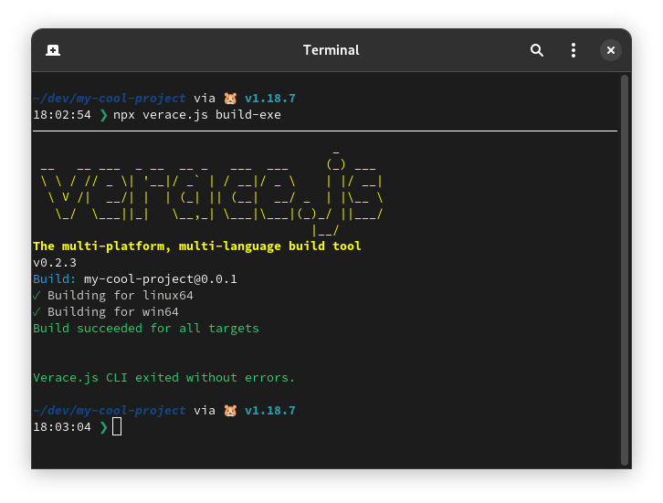

# Verace.js

> The multi-platform multi-language build tool.

> **Warning**<br />
> This project is very immature. Breaking changes are inevitable.

* Out of the box support for typescript and go
* Easy extensibility
* Modular build process with json configuration

## TL;DR

1. Create a project
```bash
$ npx verace.js create-exe
```
<p align="center">

</p>

2. Run it

```bash
$ npx verace.js run-exe
```

<p align="center">

</p>

3. Develop your app
4. Build it
```bash
$ npx verace.js build-exe
```
<p align="center">

</p>

## Install


### Standalone installation

Add a compiled stand-alone binary from releases to your local path `$PATH`

```bash
#zshrc

...
export VERACE="/path/to/verace"
export PATH="$PATH:VERACE_DIR"
...
```

### Installing using npm


```bash
$ npm i verace.js -g
```

### Running using `npx`

It is also possible to use `npx` to avoid a permanent install:

```bash
$ npx verace.js
```

> **Note** <br />
> All commands assume a permanent system binary is installed. If `npx` is used instead. Replace all mentions of `verace` with `npx verace.js`

## Why

When working on different projects, differences in build procedure can sometimes arise due. **Verace.js** aims to centralise build procedures. By implementing standardisation, bugs are more easily found and dealt with. This project was originally written for two specific projects, but then it was expanded outwards in scope an generalised.

## Examples

Two examples corresponding to the output of running `$ verace create-exe` :

- [Go](/examples/go-example/)
- [Typescript](/examples/ts-example/)

## Versioning

**Verace.js** uses [`semver`](https://github.com/npm/node-semver) versioning to manage individual project versions. The version is stored in the [`version`](#version) field of [`verace.json`](#configuring), and passed to each program in its [environment data](#implementation-details). It can be managed with:
```bash
$ verace version
```

## Configuring

All configuration for **Verace.js** lives in the `verace.json` file created in each project. Underlined properties are required.

```jsonc
//verace.json
{
    "lang": "ts",
    "name": "verace",
    "version": "0.0.2",
    "targets": ["win64", "linux64"],
    "data": { 
        "foo": "bar"
    }, 
    "hooks": {
        "preBuild": "echo hello there",
        "postBuild": "echo general kenobi"
    },
    "skipPkg": true,
    "produceTypes": true,
    "cleanAfterBuild": true,
    "test": "npx c8 ava",
    "gomod": "lspaccatrosi16/verace.js"
}
```


> **Note** <br />
>**Verace.js** will not allow building or running if there are errors in `verace.json`. You should make sure that any custom keys lie in the [`data`](#implementation-details) attribute (see below).
---
### Universal Options

#### <u>`lang`</u>
The language of the project. Must be either `ts` or `go`

#### <u>`name`</u>
The package name.

#### <u>`version` </u>
The semver package version. See [versioning](#versioning) for more details.

#### <u>`targets`</u>
The build targets for which package will be built for. Currently, building to only `win64` and `linux64` are supported due to the difficulty of testing other possible configurations.

#### `data`
Data passed in any format. See [environment data](#implementation-details) for more details.

#### `hooks`

Sometimes, it is convenient to have code automatically run directly before, or directly after the build process. This can be achieved with using build hooks:

Like `npm` scripts, build hooks can be any command, or set of commands. 
> Extensibilty with javascript/typescript is planned for the future. Currently, to implement something like that, create the javascript file and then set one of the hooks to include `node myJsScript.js`

---
### Typescript specific options
#### `skipPkg`
As produing a self contained executable from javascript is not possible due to the choice to use a [JIT](https://hacks.mozilla.org/2017/02/a-crash-course-in-just-in-time-jit-compilers/), a complete nodejs binary has to be included in every binary produced (using [`vercel/pkg`](https://github.com/vercel/pkg)). This adds `30-40MB` to each build, which is undesirable in some cases. If the binary is to be run on systems with nodejs already installed, the compilation step can be skipped. 
If disabled, a bundled javascript file can be distributed instead, which is found in the `dist` folder: e.g. `dist/verace.cjs`. 

> **Note** <br />
> A bundled file is always produced, so if both a self-contained binary, and a smaller javascript file is needed, ensure that `skipPkg` is `false`

#### `cleanAfterBuild`

If enabled, all temporary files created in the build are removed. If [`skipPkg`](#skippkg) is `false` then it will also remove the `dist` folder.

#### `produceTypes` 

Allows `d.ts` files to be produced. [`cleanAfterBuild`](#cleanafterbuild) must be disabled to make any use of them.

#### `test`

Similar to [build hooks](#hooks) in purpose. Instead of being run before/after the build process, the command is run after the initial `tsc` stage before the files are bundled (see the [Typescript build pipeline](#the-typescript-build-pipeline) for more details)

---

### Go specific options

#### <u>`gomod`</u>
The go module path.


## Implementation Details

**Verace.js** is designed in a way that lets custom data be embedded at compile-time. The most obvious example of this is the [`version`](#version), and [`name`](#name) fields which are present in every program. 

### Data embedding in Typescipt
The `index.ts` file (the entrypoint) of any program should always default export a function. **Verace.js** will then pass environment data to the program as its only argument in object format: 
```ts
//index.ts

//The does not need to be exported, and can be moved to another place, its sole purpose is to provide
//typing for the env parameter
export interface VeraceEnv {
    name: string;
    version: string;
}

export default function(env: VeraceEnv) {
  console.log(`Hello world from ${env.name} v${env.version}`);

}
```

Custom data will be parsed in the [`data`](#data) field:
```ts
//index.ts

export interface VeraceEnv {
    name: string;
    version: string;
    data: MyData;
}

interface MyData {
    foo: string;
}
```
Data will always be given in JS Object format

### Data embedding in Go

Data embedding in Go is more conventional: the core `embed` library is used which provided `//go:embed` directives. This gives the additonal flexibility which allows the data embedding to be in a separate file, as all it requires is the `//go:embed` directive to point to [`verace.json`](#configuring). The data then needs to be unmarshaled:

```go
//main.go
package main

import (
    _ "embed"
    "encoding/json"
    "fmt"
)

//go:embed verace.json
var veraceJSON []byte
//The data is embedded as a byte array


type PACKAGE struct {
	Name    string `json:"name"`
	Version string `json:"version"`
    Data CUSTOMDATA `json:"data"`
}
//A struct is defined for each level of data


type CUSTOMDATA struct {
  Foo string `json:"foo"`
}

func main() {
    var verace PACKAGE
    json.Unmarshal(veraceJSON, &verace)

    fmt.Printf("Hello world from %s v%s\n", verace.Name, verace.Version)
    fmt.Println(verace.Data.Foo)
}
```

Combining this with [build hooks](#hooks) allows powerful metadata about builds (e.g build time, build environment config) to be created, and used.


## Build Pipelines

This section outlines the build pipelines for each language in detail.

### The Typescript Build Pipeline

> **Warning** <br />
> All output directories are currently hard coded, attempting to change any locations in `tsconfig.json` will not work, and may break things.

1. The file is initially compiled to plain js by `tsc`. Type declaration files are optionally generated in this step depending on whether [`produceTypes`](#producetypes) is enabled. The output directly is `tsc-build`.
```bash
$ npx tsc
```

2. The code is compiled to commonjs format with `esbuild` and bundled to `build/veraceTemp.cjs` (the file and directories are both removed at the end of the build). Compiling to `node16` is currently selected due to compatability with `pkg`. Choice will be availible in the future.

```bash
$ npx esbuild tsc-build/index.js --outfile="build/veraceTemp.cjs" --bundle --platform=node --target=node16
```

3. A new file, `index.cjs` is created in `build`, which injects the [environment config](#data-embedding-in-typescipt) into the program.
```js
//build/index.cjs

const exec = require("./veraceTemp.cjs");
const config = require("../verace.json");

exec.default(config);
```

4. `esbuild` is run again to bundle the two files together. The output is `dist/${config.name}.cjs`
```bash
$ npx esbuild build/index.cjs --outfile="dist/${config.name}.cjs" --bundle --platform=node --target=node16
```

5. A node shebang is inserted at the top of the created file
```js
#!/usr/bin/env node

...
```

6. If [`skipPkg`](#skippkg) is `false` then the package is compiled for the [`targets`](#targets). Binaries are outputted to `bin`
```bash
$ npx pkg "dist/${config.name}.cjs" -o bin/${config.name} -t node16-linux -C GZIP
```

### The Go Build Pipeline

1. For each [target](#targets) `GOOS` is set accordingly, followed by `go build`. Binaries are outputted to `bin`

```bash
$ GOOS=windows go build -o bin/
```


## Planned features

- [ ] Add support for directly executing javascript build hooks
- [ ] Add further build targets
- [ ] Add plain javascript support
- [ ] Add more build configuration (entry points etc)
- [ ] Dramatically increase testing coverage
- [ ] Allow target node version to be configured

## Licence

This project is released under the AGPL v3 licence. See [`LICENCE`](/LICENCE) for details.

